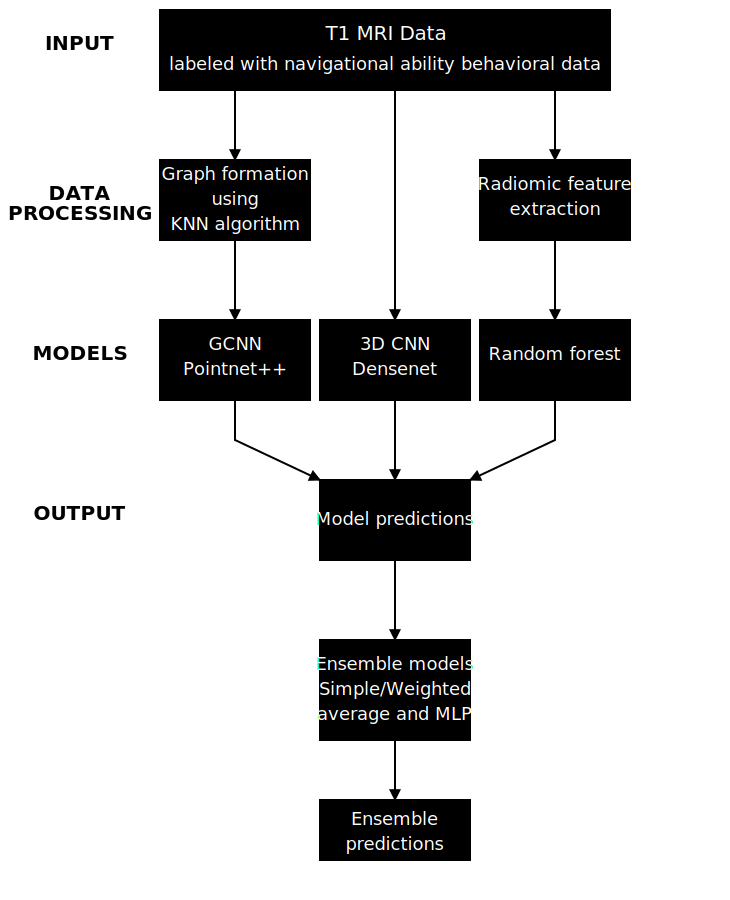

# HippocampAI: Deep Learning for Brain-Behavior Mapping

Research code for predicting spatial navigation ability from brain MRI structure using deep learning.

## 📄 Paper

**"Deep learning approaches to map individual differences in macroscopic neural structure with variations in spatial navigation behavior"**

*Ashish K. Sahoo¹, Hajymyrat Geldimuradov¹, Kaleb E. Smith², Aaron Zygala¹, Yiming Cui¹, Mahsa Lotfollahi², Kuang Gong³, Alina Zare⁴, Steven M. Weisberg¹,⁵*

¹ Department of Psychology, University of Florida
² NVIDIA, Santa Clara, CA
³ Department of Biomedical Engineering, University of Florida
⁴ Department of Electrical and Computer Engineering, University of Florida
⁵ Center for Cognitive Aging and Memory, University of Florida

---

## 🎯 Overview

This repository contains code for three deep learning approaches to predict spatial navigation ability from T1 MRI brain scans:

1. **DenseNet (3D-CNN)** - Dense convolutional neural networks on volumetric MRI data
2. **PointNet++ (GCNN)** - Graph convolutional neural networks on point cloud representations
3. **Radiomics + Random Forest** - Traditional radiomic features with machine learning

**Dataset:** 90 participants (54 women, mean age 23.1 years)
**Task:** Virtual Silcton navigation task (model-building score)
**Regions:** 7 brain regions (hippocampus, thalamus, whole brain, amygdala, entorhinal, isthmus cingulate, parahippocampus)

---

## 📊 Key Results

### Base Model Performance (Mean Correlations)

| Brain Region | DenseNet | PointNet++ | Radiomics |
|--------------|----------|------------|-----------|
| Hippocampus  | 0.12 ± 0.21 | 0.05 ± 0.24 | 0.10 ± 0.23 |
| Thalamus     | 0.20 ± 0.19 | 0.12 ± 0.24 | 0.26 ± 0.22 |
| Whole Brain  | 0.07 ± 0.20 | 0.18 ± 0.21 | 0.21 ± 0.22 |

### Ensemble Model Performance

| Brain Region | Simple Average | Weighted Average | Optimized MLP |
|--------------|----------------|------------------|---------------|
| Hippocampus  | 0.16 | 0.08 | **0.29** |
| Thalamus     | 0.23 | 0.36 | **0.39** |
| Whole Brain  | 0.19 | 0.08 | **0.32** |

**Key Finding:** Weak to moderate correlations suggest that structural brain features alone may not strongly predict navigation ability in typical young adults.

---

## 📁 Repository Structure

```
hippocampAI/
│
├── Densenet runs/                    # DenseNet 3D-CNN training scripts
│   ├── DenseNet_hippocampus_*.py     # 5 seeds × 7 regions = 35 scripts
│   ├── DenseNet_thalamus_*.py        # Seeds: 01, 08, 14, 37, 65
│   └── ... (60 .py + 60 .sh files)
│
├── Pointnet runs/                    # PointNet++ GCNN training scripts
│   ├── pointnet_hippocampus_fs_*.py  # 5 seeds × 7 regions = 35 scripts
│   ├── pointnet_thalamus_fs_*.py     # Seeds: 01, 08, 14, 37, 65
│   └── ... (60 .py + 60 .sh files)
│
├── Preprocessing/                    # Data preprocessing pipelines
│   ├── standardized_normalized_hippocampus_intensity_brain_181023.py
│   ├── standardized_freesurfer_wb_hippo_thalamus_data_creation_181023_new1_9_25.ipynb
│   ├── workflow_final.ipynb
│   └── Pointnet files creation/      # 8-KNN graph construction (12 files)
│
├── densenet_results/                 # DenseNet job output logs (105 files)
├── pointnet_results/                 # PointNet job output logs (105 files)
│
├── radiomic_results/                 # Radiomics features and analysis
│   ├── mri_radiomics_features_regions_*.csv  # Extracted features (8 files)
│   ├── DataAnalysisWith90Participants_Jupyter.csv  # Behavioral data
│   └── pyradiomics_final_4924_defaultvalues_new_regions_1_9_25_correctedstandard.ipynb
│
├── final_ensemble_15sep25/           # Ensemble predictions and analysis
│   ├── densenet_*_predictions_with_average_and_id.csv  # 7 regions
│   ├── pointnet_*_predictions_with_average_and_id.csv  # 7 regions
│   ├── random_forest_pyradiomics_*_predictions_with_average_and_id.csv  # 7 regions
│   └── ensemble_final_22sep25.ipynb  # Ensemble analysis notebook
│
└── Base model data analysis_final_21sep25.ipynb  # Main results analysis
```

---

## 🧠 Brain Regions Analyzed

### Primary Regions
- **Hippocampus** (FreeSurfer labels: 17, 53) - Main region of interest for spatial navigation
- **Whole Brain** - Complete brain analysis

### Control Region
- **Thalamus** (labels: 10, 49) - Control region not directly involved in navigation

### Exploratory Regions (Navigation-Related)
- **Amygdala** (labels: 18, 54) - Anatomically close to hippocampus
- **Entorhinal Cortex** (labels: 1006, 2006) - Spatial navigation processing
- **Isthmus Cingulate** (labels: 1010, 2010) - Navigation-related region
- **Parahippocampal Cortex** (labels: 1016, 2016) - Spatial memory

---

## 🔬 Methodology

### 1. Data Preprocessing
- **MRI Scans:** T1 structural scans (3T Siemens Trio, 64-channel head coil)
- **FreeSurfer 4.5:** Brain region segmentation and masking
- **Normalization:** Voxels standardized to 1mm³, min-max intensity normalization
- **Participants:** N=90 (from Weisberg et al., 2019)

### 2. DenseNet (Section 2.4.1)
**Architecture:**
- 4 dense blocks: [6, 12, 24, 16 layers]
- Growth rate: 32
- Global average pooling + regression output

**Training:**
- Learning rate: 0.0001
- Batch size: 4
- Epochs: 100 per fold
- 5-fold cross-validation
- 5 random seeds × 3 runs = 15 total runs per region
- Optimizer: Adam
- Loss: MSE

### 3. PointNet++ (Section 2.4.2)
**Architecture:**
- 8-nearest neighbors (8-KNN) graph construction
- 3 PointNetLayers: [1 → 32 → 64 → 128 features]
- Global max pooling + regression output

**Training:**
- Learning rate: 0.001
- Batch size: 1
- Epochs: 100 per fold
- 5-fold cross-validation
- 5 random seeds × 3 runs = 15 total runs per region
- Optimizer: Adam
- Loss: MSE

### 4. Radiomics + Random Forest (Section 2.4.3)
**Feature Extraction (PyRadiomics 3.1.0a2):**
- First-order statistics
- Shape-based features
- GLCM, GLRLM, GLSZM, NGTDM, GLDM features
- Default parameters: binWidth=25, force2D=False

**Training:**
- Random Forest with 100 trees
- 5-fold cross-validation across 15 random seeds

### 5. Ensemble Methods (Section 2.5)
Three approaches to combine predictions:
1. **Simple Average** - Arithmetic mean of all model predictions
2. **Weighted Average** - Linear regression-optimized weights
3. **Optimized MLP** - Multi-layer perceptron with grid search hyperparameter tuning

---

## 🚀 Quick Start

### Prerequisites
- Python 3.8+
- PyTorch 1.10+
- PyTorch Geometric 2.0+
- MONAI 0.8+
- PyRadiomics 3.0+
- FreeSurfer 4.5
- CUDA-capable GPU (for training)
- SLURM HPC environment (for batch jobs)

### Training Models

#### DenseNet
```bash
# Train hippocampus with seed 01
python "Densenet runs/DenseNet_hippocampus_01.py"

# Or submit to SLURM
sbatch "Densenet runs/DenseNet_hippocampus_01.sh"
```

#### PointNet++
```bash
# Train hippocampus with seed 01
python "Pointnet runs/pointnet_hippocampus_fs_01.py"

# Or submit to SLURM
sbatch "Pointnet runs/pointnet_hippocampus_fs_01.sh"
```

#### Radiomics
```bash
# Open the radiomics notebook
jupyter notebook "radiomic_results/pyradiomics_final_4924_defaultvalues_new_regions_1_9_25_correctedstandard.ipynb"
```

### Analysis

```bash
# Main results analysis
jupyter notebook "Base model data analysis_final_21sep25.ipynb"

# Ensemble analysis
jupyter notebook "final_ensemble_15sep25/ensemble_final_22sep25.ipynb"
```

---

## 📈 Data Pipeline



---

## 📊 Evaluation Metrics

**Primary Metric:** Pearson correlation (r) between predicted and actual Model Building Total scores

**Statistical Tests:**
- Shapiro-Wilk test for normality
- One-sample t-test vs. zero
- Mean ± SD across all cross-validation folds

**Cross-Validation:**
- 5-fold cross-validation
- 5 random seeds: [1, 8, 14, 37, 65]
- 3 runs per seed
- Total: 75 correlation values per region per model

---

## 📂 Key Files

### Main Analysis Notebooks
- **`Base model data analysis_final_21sep25.ipynb`** - Primary results analysis (Sections 3.1-3.3)
- **`final_ensemble_15sep25/ensemble_final_22sep25.ipynb`** - Ensemble analysis (Section 3.4)

### Preprocessing Notebooks
- **`Preprocessing/workflow_final.ipynb`** - Data preprocessing workflow
- **`Preprocessing/standardized_freesurfer_wb_hippo_thalamus_data_creation_181023_new1_9_25.ipynb`** - FreeSurfer data preparation

### Radiomics Analysis
- **`radiomic_results/pyradiomics_final_4924_defaultvalues_new_regions_1_9_25_correctedstandard.ipynb`** - Feature extraction and analysis

### Ensemble Analysis
- **`radiomic_results/pyradiomics_final_4924_defaultvalues_new_regions_1_9_25_correctedstandard.ipynb`** - Feature extraction and analysis

### Behavioral Data
- **`final_ensemble_15sep25/ensemble_final_22sep25.ipynb`** - Feature extraction and analysis

### Predictions
- **`final_ensemble_15sep25/densenet_*_predictions_with_average_and_id.csv`** - DenseNet predictions (7 regions)
- **`final_ensemble_15sep25/pointnet_*_predictions_with_average_and_id.csv`** - PointNet predictions (7 regions)
- **`final_ensemble_15sep25/random_forest_pyradiomics_*_predictions_with_average_and_id.csv`** - Radiomics predictions (7 regions)

---

## 📝 Citation

If you use this code or data, please cite:

```bibtex
@article{sahoo2024hippocampai,
  title={Deep learning approaches to map individual differences in macroscopic neural structure with variations in spatial navigation behavior},
  author={Sahoo, Ashish K and Geldimuradov, Hajymyrat and Smith, Kaleb E and Zygala, Aaron and Cui, Yiming and Lotfollahi, Mahsa and Gong, Kuang and Zare, Alina and Weisberg, Steven M},
  journal={TBD},
  year={2024}
}
```

**Original behavioral data from:**
```bibtex
@article{weisberg2019everyday,
  title={Everyday taxi drivers: Do better navigators have larger hippocampi?},
  author={Weisberg, Steven M and Newcombe, Nora S and Chatterjee, Anjan},
  journal={Cortex},
  volume={115},
  pages={280--293},
  year={2019}
}
```

---

## 📚 Related Publications

1. Weisberg, S. M., Newcombe, N. S., & Chatterjee, A. (2019). Everyday taxi drivers: Do better navigators have larger hippocampi? *Cortex*, 115, 280-293.

2. Schinazi, V. R., et al. (2013). Hippocampal size predicts rapid learning of a cognitive map in humans. *Hippocampus*, 23(6), 515-528.

3. Maguire, E. A., et al. (2000). Navigation-related structural change in the hippocampi of taxi drivers. *PNAS*, 97(8), 4398-4403.

---

## 💾 File Statistics

- **Total files:** 371
- **Python scripts:** 127 (120 training + 7 preprocessing)
- **Shell scripts:** 120 (SLURM submissions)
- **Jupyter notebooks:** 4
- **CSV files:** 31 (predictions and features)
- **Log files:** 210 (job outputs)

---

## 🤝 Acknowledgments

**Funding:**
- AI Catalyst Grant, University of Florida
- NIH/NIA AG070333
- FDOH 21A09

**Original MRI data collection:**
- NIH grants U01EY025864, R01EY022350 (to Geoff Aguirre)
- NIH grants F32DC015203 (to S.M.W.), R01DC012511 (to Anjan Chatterjee)

**Computing Resources:**
- University of Florida Research Computing (HPC)

---

## ✉️ Contact

**Principal Investigator:**
- Steven M. Weisberg, PhD
- Email: stevenweisberg@ufl.edu

**Lead Developer and First Author:**
- Ashish K. Sahoo
- Email: ashishkumarsahoo@ufl.edu

**Repository:** https://github.com/TheDragon246/hippocampAI

---

## 📄 License

This work is licensed under a Creative Commons Attribution 4.0 International License (CC-BY 4.0).

You are free to:
- **Share** — copy and redistribute the material in any medium or format
- **Adapt** — remix, transform, and build upon the material for any purpose, even commercially

Under the following terms:
- **Attribution** — You must give appropriate credit, provide a link to the license, and indicate if changes were made.

See the full license at: https://creativecommons.org/licenses/by/4.0/

When using this code or data, please cite:
```bibtex
@article{sahoo2024hippocampai,
  title={Deep learning approaches to map individual differences in macroscopic neural structure with variations in spatial navigation behavior},
  author={Sahoo, Ashish K and Geldimuradov, Hajymyrat and Smith, Kaleb E and Zygala, Aaron and Cui, Yiming and Lotfollahi, Mahsa and Gong, Kuang and Zare, Alina and Weisberg, Steven M},
  journal={TBD},
  year={2024}
}
```
---

**Last Updated:** October 2025
